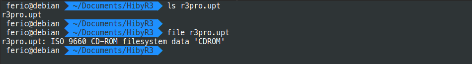
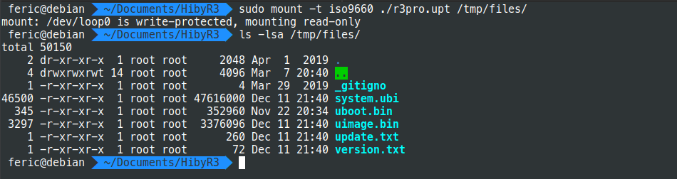
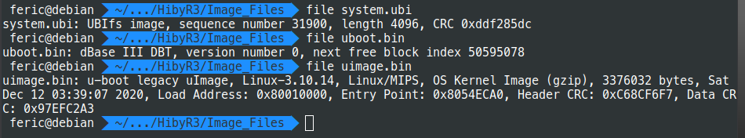
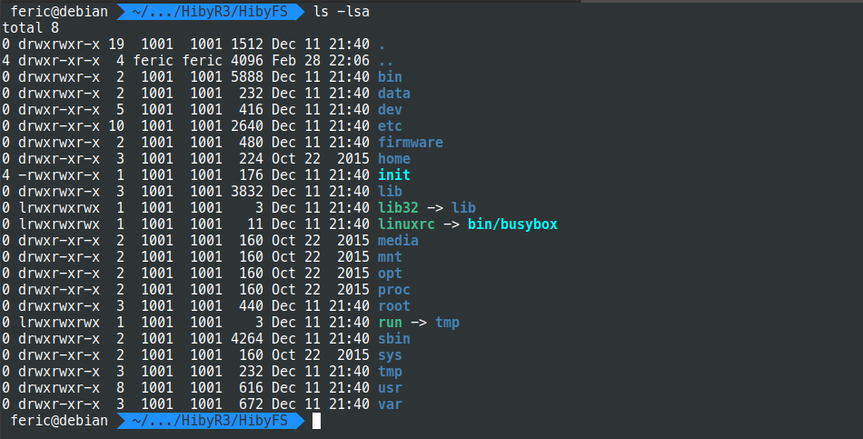

#Firmware and File System
###Mount the file system
Once downloaded the Hiby firmware, it's possible to identify what kind of file it is by running <b>file</b> command</p>
File Command |
-|
|
As shown in the above screenshot, the **r3pro.upt** is a ISO 9660 CD-ROM filesystem which it's possible to mount it using the following command
`sudo mount -t iso9660 ./r3pro.upt <dst folder> `
The mounted file system contains several files used to flash the Hiby R3, it contains a boot system, a File system, etc.
Content of File System |
-|
|
The **system.ubi** contains whole the File System of the device, the FS regards to a UBIFS, a file system specifically made for work in Flash memories.
File type of system.ubi |
-|
|
___
In order to mount and access to the File System, some dependencies must be insalled
`$ apt install mtd-utils`

Once the dependencies have been covered, the UBIFS format requires to create a flash memory.
Visit the following URL for more information <https://gist.github.com/kostaz/6ce4034192ac3a0f08ec3e279c81d0b8>

Here is a script that contains the commands to automate the Flash memory creation and mounting on it
```
#!/bin/bash
# size of created mtd is 256.0 MiB
modprobe nandsim first_id_byte=0x2c second_id_byte=0xda third_id_byte=0x90 fourth_id_byte=0x95
flash_erase /dev/mtd0 0 0
ubiformat /dev/mtd0 -s 2048 -O 2048
modprobe ubi
ubiattach -m 0 -d 0 -O 2048
# set $(SIZE) to value more than size of the ubifs filesystem
#ubimkvol /dev/ubi0 -N volname -s $(SIZE)
ubimkvol /dev/ubi0 -N volname -s 50MiB
#ubiupdatevol /dev/ubi0_0 $(UBIFS)
ubiupdatevol /dev/ubi0_0 /home/feric/Documents/HibyR3/Image_Files/system.ubi
mount -t ubifs /dev/ubi0_0 /home/feric/Documents/HibyR3/HibyFS/
```
Once executed the script, the UBIFS is accessible as shown below
Mounted FS|
-|
|