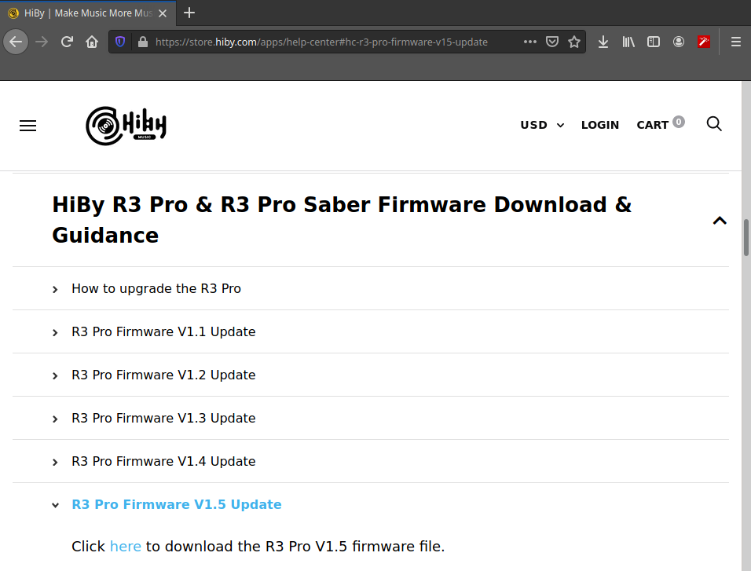

<body>
	<section>
		<h1>A repo for Hiby devices</h1>
		<h3>What is Hiby?</h3>
		
Established in 2011, HiBy Music specializes in research, development, and sales of high quality portable audio products. With over 40 professional audio R&D staff and nearly 20 years of experience in the portable audio field, they have developed dozens of portable digital audio players (DAPs), earphones, USB DACs, etc...

		<h3>What is this repo?</h3>
		
I created this repo is to show my findings on my Hiby R3 Saber Pro device.

		
The analysis was conducted to a Hiby R3 Pro saber firmware, the device is a portable music player from Hiby vendor.The Firmware version analyzed is <b>Pro v1.5</b> and can be downloaded at:

		<a href="https://drive.google.com/drive/folders/1IUk1GZIR6TofowUjEew5L7Mh5yQ98TMF?usp=sharing" target="_blank">https://drive.google.com/drive/folders/1IUk1GZIR6TofowUjEew5L7Mh5yQ98TMF?usp=sharing"</a>
		 
		<table>
			<tr>
				<th align="center">Download Page</th>
			</tr>
			<tr>
				<td align="center"></img></td>
			</tr>
		</table>
		 
	</section>
	  <footer></img></footer>
</body>