# Arbitrary File Upload
## Supported Files
The web application allows users to upload files based in their extensions, the majority of them related to sound formats (MP3,FLAC, AIF, etc)

Extensions allowed |
-|
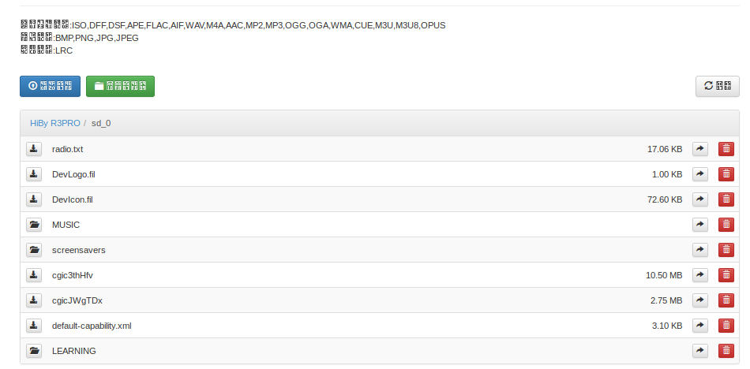|
___

When a file that doesn't match the allowing formats is uploaded to the application, it is shown a warning message
Failed File Upload |
-|
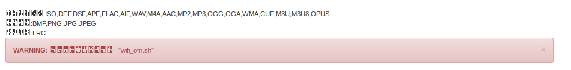|
___

### JavaScript Analysis
A Javascript analyzes was done to confirm the file extension verification is peformed during file uploading, this function was found in **index.js** file.

At line 40, the **\_validFileTypes** variable is initialized, the variable contains an array with allowed formats:

Allowed Extensions |
-|
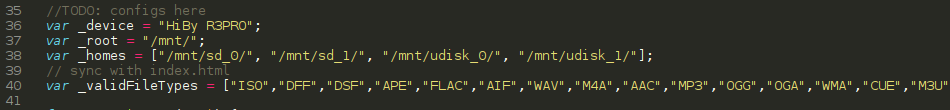|

As shown in the image below, this variable is used in **\_isValidFileType** function, the function verifies the file extension agains the **\_validFileTypes** content. With this information, it's possible to bypass the validation mechanism by adding an arbitrary extension to the JavaScript, another approach would be tampering the request and modify it on the fly the file extension, personally, I prefere the first approach. 

JavaScript extension validation |
-|
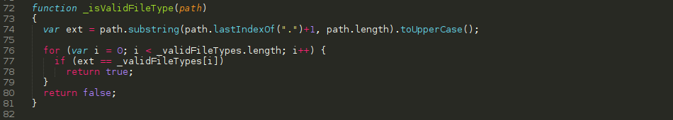|

The following image show the **SH** extension has been added to the allowed extensions

Adding SH extension |
-|
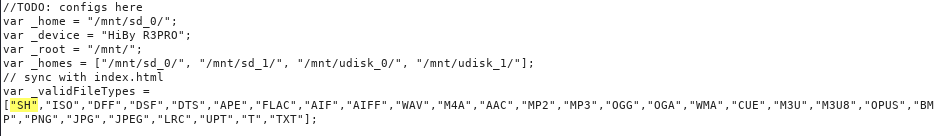|

___

### Static Analysis

A simple way to take advantage of file uploading is to replace a file used by the system and inject malicious code; for this Proof of Concept, I searched for SH files in the file system and found several potential targets. I chose the wifi scripts for this.

SH files|
-|
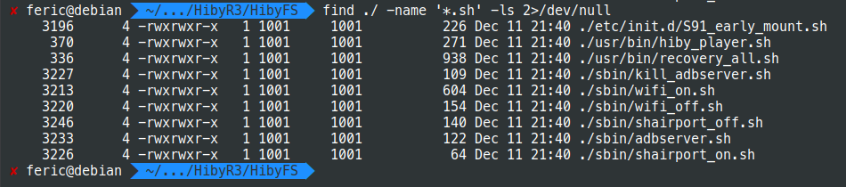|

The next step is to find where the selected script is used, i have performed a simple string search using grep and found the sys_server binary contains the string "wifi_off.sh"

Binary file matching the pattern|
-|
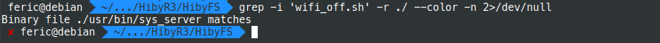|

As shown in the following image, both wifi_on.sh and wifi_off.sh are passed as argument to system function

Binary file matching the pattern|
-|
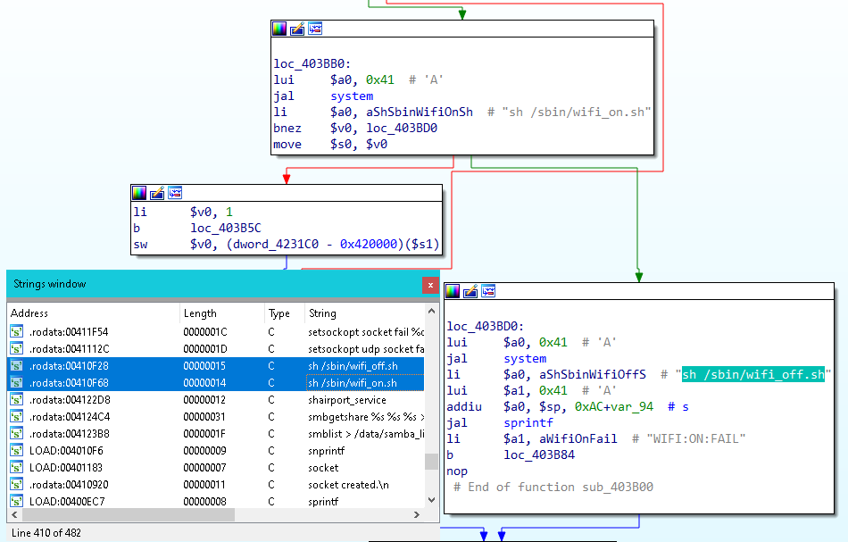|

___

### Running commands

A simple echo command was added to **wifi_off.sh** file:

echo command added|
-|
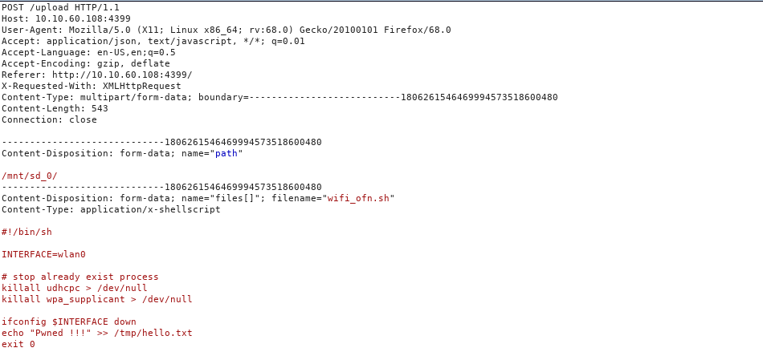|

As shown below, the file has been uploaded to the File system:

File uploaded|
-|
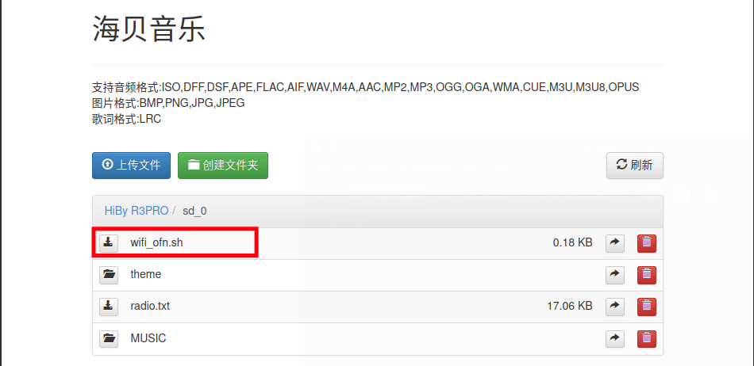|

Next step is to move the file into /sbin/ path, this can be done through the application interface, the request sent to the application is shown below:

File uploaded|
-|
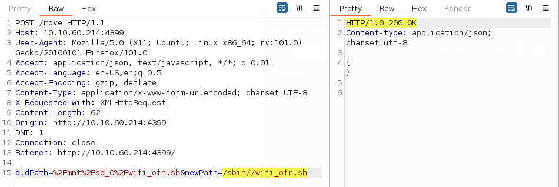|

This could confirm by accessing to /sbin/ through the web interface

File uploaded|
-|
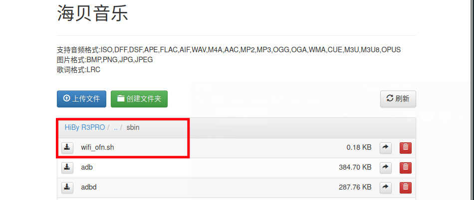|

Next step is exchaning the original and new script names

Renaming file request|
-|
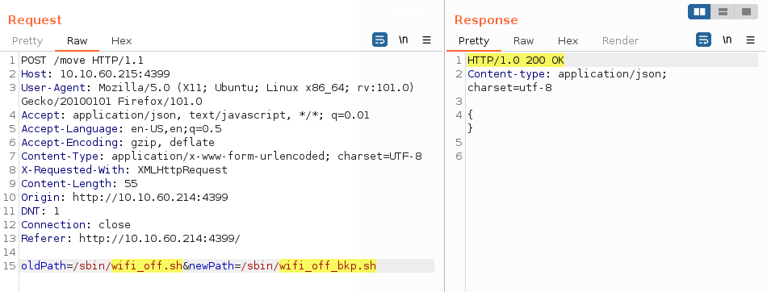|

New filename|
-|
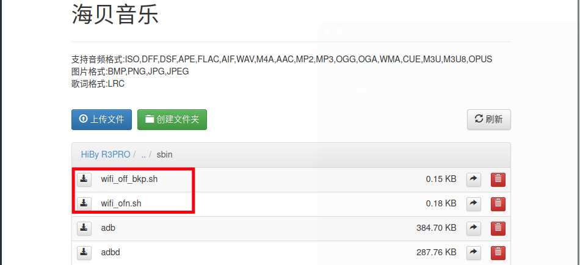|

Renaming modified file|
-|
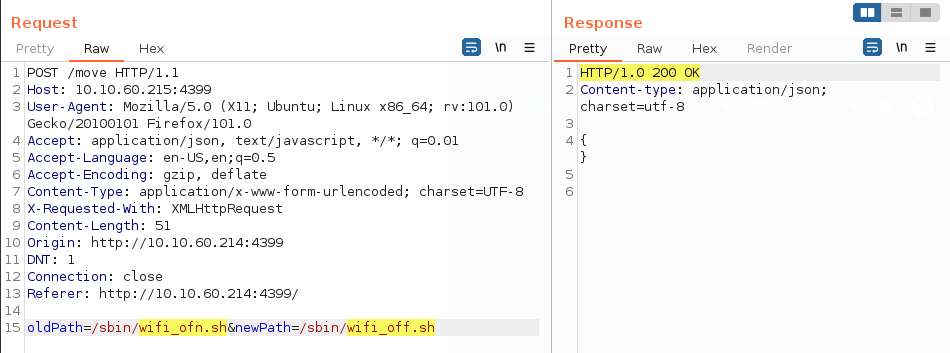|

Once done, there is no more action than turning off the Wifi connection, the script is executed and the file /tmp/hello.txt should be created as shown below

The following image shows the files existing in /tmp/ folder before running the script

Content in /tmp/ folder|
-|
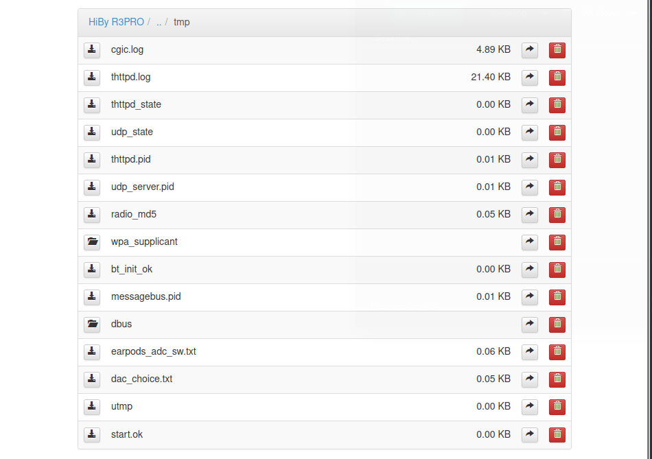|

hello.txt file in /tmp/|
-|
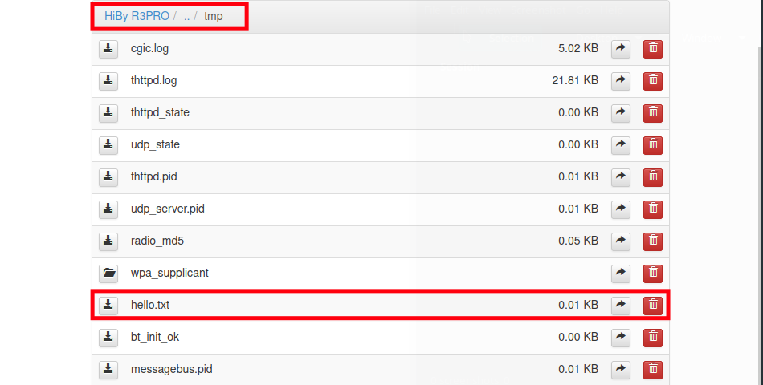|

Finally, when reading the content of hello.txt file, it contains the expected String as shown below:

hello.txt content|
-|
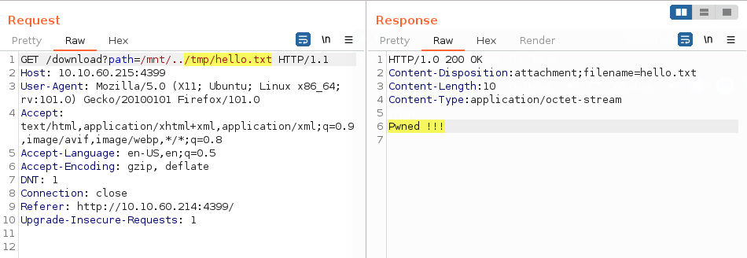|

