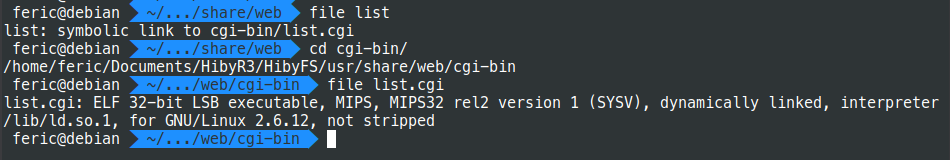
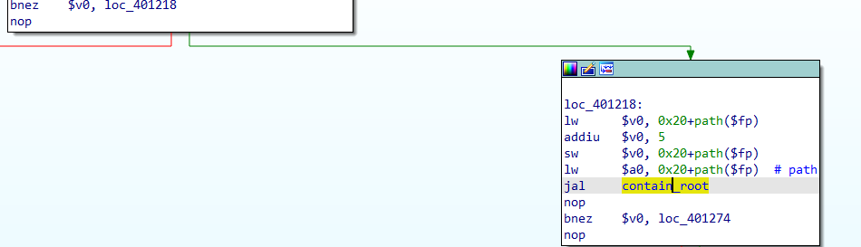

# HTTP Server Analysis
## Dynamic Analysis
The Hiby device allows to transfer files over an HTTP service, the HTTP server is activated by selecting Import Music via Wi-Fi from main menu, once done, it shown an image like the following

HTTP server enabled |
-|
|

As shown in the following screenshot, once the HTTP server has been enabled, it is accessible using a web browser at port 4399

Listed Files |
-|
|
___

### Listing Files
The Web application mounts the **SD Card** and let it accessible through the web application

SD Card Content |
-|
|

When moving through the Folders of the SD Card, I noticed the path is submitted to the web application via the **path** parameter
`http://10.10.60.120:4399/list?path=%2Fmnt%2Fsd_0%2FMUSIC%2F`

Files Requested |
-|
|

___

### Path Traveral Vulnerability
The directory listing feature only allows to list the content of the **/mnt/sd_0** folder, this is the path of the SD card; However it's possible to retrieve the content of the Root File System by passing this simple payload **/mnt/../../**.

The following screenshot shows the content of Root folder after submitting the payload
` http://10.10.60.120:4399/list?path=%2Fmnt%2Fsd_0%2F/../../ `

Listing Root Path |
-|
|
|

___
#### Client-Side Validation

It's worth mentioning there is a JavaScript file that list files when a valid path is supplied.
**There are more details of this in the Static Analysis section**.

When the index.html is accessed, the index.js file is loaded, this file has a JQuery function that sends a GET request to ** ?list ** resource with the default path **/mnt/** .

Take a look at lines from 120 to 130 of the following screenshot

JQuery - List files Section |
-|
|

The path must be a valid string and it's verified in the **_isRoot** function, check line 134

The screenshot below shows the **_isRoot** function which verifies if the path supplied matches with the **_root** variable (check line 37).

JQuery - List files Section |
-|
|

This means, in order to list a folder, the path variable must begin with /mnt/

___

## Static Analysis
### Server-Side Validation

As previously discussed, the JavaScript file just verifies if the path submitted contains the **/mnt** string.

Now that I had access to the File System, I noticed the Web application's files are located inside **/usr/share/web** and they are CGI files.

Web Application Files |
-|
|

The Path Traversal vulnerability was identified in **list** resource, so I decided to analyse the list.cgi file.

As shown below, the list.cgi file was compiled for MIPS32 architecture, i decided to use IDA Pro for the static analysis.

Type of list.cgi |
-|
|

The following image shows the firsts instructions of the **Main** function, which receives the HTTP headers and parses the requests

Main Function |
-|
|

Immediately then transfers the flow to **cgiMain** function using the `jal cgiMain` instruction.

Calling cgiMain |
-|
|

####cgiMain Function

Once the control has been passed to cgiMain, the function searches for path variable in the URL

cgiMain Instructions|
-|
|

The highlighted in blue instruction (0x004011C0) loads the memory address of **cgiQueryString** variable into $v0 variable. After that, it moves the content from $v0 to $a0 (0x004011C8 instruction).

cgiMain Instructions|
-|
|

The above highlighted instructions (0x004011CC) performs a load upper immediate, this means that it's going to take the upper 16 bits of the string, the 0x41 value is converted to 0x41000 and stored into $v0, then, it's performed a subtraction between the address of aPath variable minus 0x41000.
Immediately, there is an addition instruction (0x004011D0) between the last value and $v0, the $a1 variable contains the address of **aPath**, which contains the string of the parameter **path=**.

cgiMain Instructions|
-|
|

Finally, the registers $a0 and $a1 are the arguments of **strstr** function (0x004011D4), the pseudocode looks like this

```$a0 = "<URL>"
$a1 = "path="
strstr($a0,$a1)
```

The strstr functions finds the first coincidence in a string and stores into $v0 register, so for this case, if the URL is like _http://10.10.10.222/list?path=/mnt/sd_card0/_, the $v0 register will contains **path=/mnt/sd_card0/** string.

cgiMain Instructions|
-|
|

The following instruction (0x004011D4) `sw $v0, 0x20+path($fp)`, stores the content of $v0 (path string) into memory address at 0x20+path($fp). Immediately, the content of the memory 0x20+path($fp) is loaded into $v0. Why is doing this?, honestly i don't know.

cgiMain Instructions|
-|
|

####Analyzing path variable
#####loc_401218 Subroutine
The flow has been transfered to subroutine **loc_401218**, the purpose of this is to retrieve the content of **path** parameter, which contains the string of the path to list.

cgiMain loc_401218|
-|
|

The code of subroutine loc_401218 is like the follow

```
.text:00401218     lw      $v0, 0x20+path($fp)
.text:0040121C     addiu   $v0, 5
.text:00401220     sw      $v0, 0x20+path($fp)
.text:00401224     lw      $a0, 0x20+path($fp)  # path
.text:00401228     jal     contain_root
.text:0040122C     nop
.text:00401230     bnez    $v0, loc_401274
.text:00401234     nop
```

The firsts 2 instructions (0x00401218 & 0x0040121C) just "remove" the string _path=_ from a string like _path=/mnt/sd_card0/_, storing the string **/mnt/sd_card0/** into $v0 register. Then, this new string is verified into **containt_root** function.

After that, the `0x00401220` instruction stores the content of $v0 register (the path string) into the address `0x20+path($fp)`. Immediately, the next instruction stores the content of this address  $a0 registers that works as argument of **contain_root** function.

#####contain_root Function

The following section describes the behavior of _contain_root_ function

cgiMain contain_root|
-|
|

Following with the instructions of this subroutine, the `0x00409020` just loads the path string into $a0 register and the next 2 instructions just loads the content of **_roots** string into $a1, it's worth mentioning the `_roots` string has a similar content as shown in the client-side analysis section, and contains the **/mnt** string.

Finally the `0x00409028` instruction performs a call to **_contains** function.

```
.text:0040901C     lw      $a0, 0x18+path($fp)  # path
.text:00409020     lui     $v0, 0x42  # 'B'
.text:00409024     addiu   $a1, $v0, (_roots - 0x420000)  # cmps
.text:00409028     jal     _contains
.text:0040902C     nop
```

cgiMain \_roots string|
-|
|

#####\_contains Function
Now the \_contains function is called, they were passed both strings path and /mnt and the path to list.

cgiMain \contains function|
-|
|

This function just compares the path supplied in the request and the /mnt string, the key block is the subroutine loc_408e70

cgiMain \contains function|
-|
|

```
.text:00408E70 loc_408E70:                              # CODE XREF: _contains+80↓j
.text:00408E70     lw      $v0, 0x20+cmp($fp)
.text:00408E74     lw      $v0, 0($v0)
.text:00408E78     move    $a0, $v0         # s1
.text:00408E7C     lw      $a1, 0x20+path($fp)  # s2
.text:00408E80     jal     strcmp
.text:00408E84     nop
.text:00408E88     bgtz    $v0, loc_408E9C
.text:00408E8C     nop
.text:00408E90     li      $v0, 1
.text:00408E94     b       loc_408EBC
.text:00408E98     nop
```

The instruction `0x00408E80` performs a string compare between **S1 ("/mnt/")** and **S2 (user's path)**, the concern is the section where the strcmp performs the comparation, the result of $v0 is not greater than zero, in consequence, it takes the branch to `li     $v0, 1` (marked in blue)

cgiMain \contains function|
-|
|

As $v0 is 1, when returns to cgiMain, it takes the branch to **loc_401274**, the following subroutines just open the directory and list the content of the folder.

cgiMain \contains function|
-|
|
