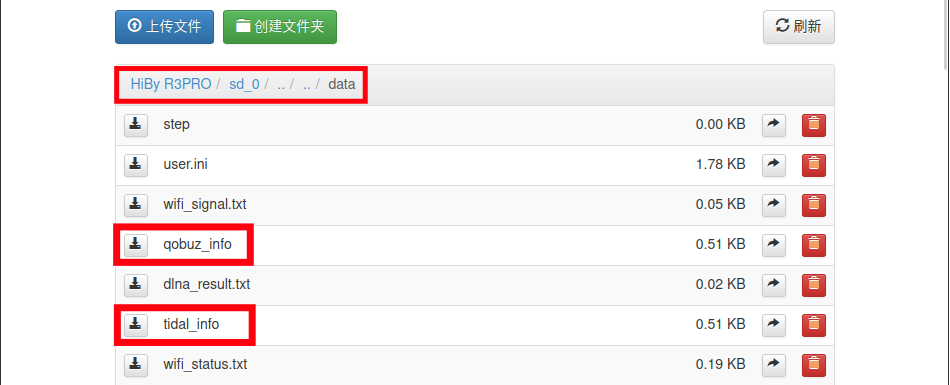
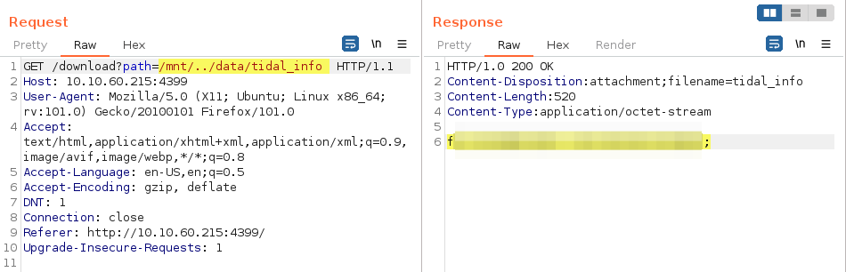
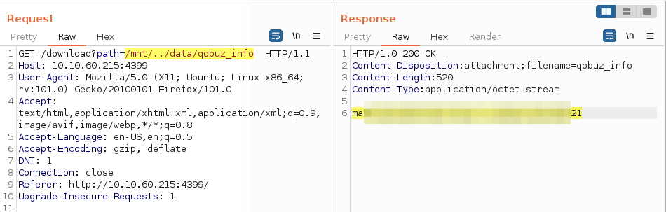

# Sensitive Information
## Access Credentials
The Hiby device stores information regarding Music Streaming services ** Tidal & Qobuz ** in an insecure way, these information may be retrieved when accessing through the URL http://<hiby_IP_Address>:port/download?path=/mnt/../data/qobuz_info for tidal and http://<hiby_IP_Address>:port/download?path=/mnt/../data/qobuz_info for Qobuz

The following screenshot shows the files in /data/ directory containing access information related Streaming services before mentioned (Tidal & Qobuz):

Sensitive Files |
-|
|
___

### Tidal information
The below image shows the content file for tidal access:

Tidal credentials |
-|
|

___

### Qobuz information
The following image shows qobuz access for this service:

Qobuz credentials |
-|
|
