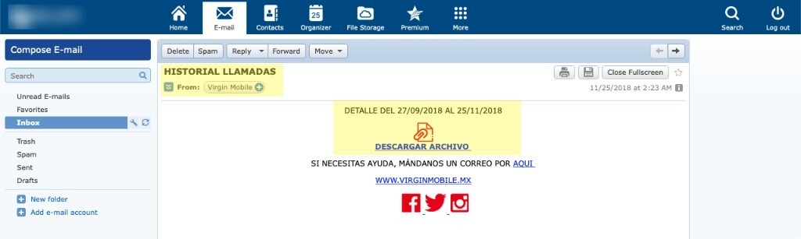

<body>
	<h1>Virgin Mobile - Horizontal Privilege Escalation</h1>
	<section>
		
La aplicación móvil de Virgin mobile tiene una funcionalidad que permite al usuario visualizar su historial de llamadas en un periodo de tiempo; sin embargo, esta funcionalidad puede ser abusada por un usuario malicioso para obtener el registro de llamadas de cualquier otro usuario de virgin mobile con el simple hecho de conocer su número telefónico.

		 
		<table>
			<tr>
				<th align="center">Mi cuenta - Estatus</th>
			</tr>
			<tr>
				<td align="center"></td>
			</tr>
		</table>
		 
		
Como se aprecia en la siguiente imágen, mi número solo cuenta con 4 pesos de saldo, al igual que no cuento con algún paquete activado.

		<table>
			<tr>
				<th align="center">Mi cuenta - Saldo</th>
			</tr>
			<tr>
				<td align="center"></td>
			</tr>
		</table>
		 
		
Al momento de ingresar al panel principal de la aplicación se realiza una petición al servidor <b>prodapi.vmmx2.com</b>, enviando como argumento el número telefónico de la línea a consultar. Como se muestra en la siguiente captura de pantalla, el parámetro <b>phone_number</b> es controlado por el usuario, siendo posible obtener información de otros usuarios.

		 
		<table>
			<tr>
				<th align="center">Datos - Otro Número</th>
			</tr>
			<tr>
				<td align="center"></td>
				<td align="center"></td>
			</tr>
		</table>
		 
		
<b>Nótese que</b>, al cambiar el número telefónico por el de otro usuario, en la aplicación se visualiza la información asociada al número de la cuenta de Virgin Mobile.

		
Por otra parte, al consultar el historial de llamadas se observa el mismo comportamiento.
		 Las siguientes capturas de pantalla muestran el proceso de visualización y envío del historial de llamadas a un correo electrónico: La siguiente imagen es el historial de llamadas de mi propia cuenta, y como se observa, no cuento con detalles de llamadas.
		

		 
		<table>
			<tr>
				<th align="center">Datos - Historial otro número</th>
			</tr>
			<tr>
				<td align="center"></td>
				<td align="center"></td>
			</tr>
		</table>
		 
		
Nuevamente, al cambiar el número de teléfono por el de otro usuario, se obtiene el registro de llamadas telefónicas que ese número ha realizado.

		 
		<table>
			<tr>
				<th align="center">Datos - Historial otro número</th>
			</tr>
			<tr>
				<td align="center"></td>
				<td align="center"></td>
			</tr>
		</table>
		 
		
Al presionar el botón de enviar por Email se repite el proceso de enviar los parámetros de la cuenta a visualizar, la siguiente imagen muestra el envío de correo de la cuenta que no tiene información:

		 
		<table>
			<tr>
				<th align="center">Datos - Envío por correo</th>
			</tr>
			<tr>
				<td align="center"></td>
				<td align="center"></td>
				<td align="center"></td>
			</tr>
		</table>
		 
		
Como se mostró anteriormente, no hay detalle de llamadas para este número, pero al alternar con otra cuenta se muestra la información que se busca:

		 
		
Las siguiente captura de pantalla muestran el detalle de llamadas de otro número telefónico.

		 
		<table>
			<tr>
				<th align="center">Datos - Envío por correo</th>
			</tr>
			<tr>
				<td align="center"></td>
				<td align="center"></td>
			</tr>
		</table>
		 
		
Como se demostró anteriormente, considero que esta funcionalidad puede ser abusada para la obtención de información de otros usuarios sin su consentimiento, teniendo un impacto directo en la confidencialidad y privacidad de la información de los usuarios.
	
	</section>
	<footer>Reported by me to Virgin Mobile Mexico Team in 2018</footer>
</body>